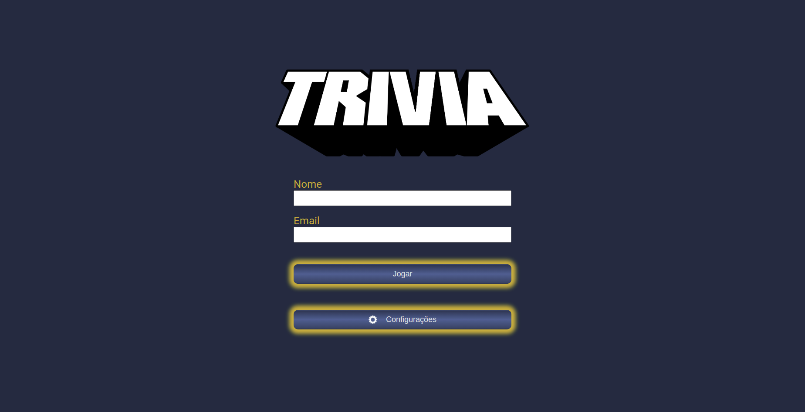

# Welcome to Trivia game's repository!
 
 

 

The proposal here was to develop a game similar to  **Trivia**, a game show of questions and answers using React and Redux. The main features included:

- Simulate a user login page, and, in case this email is registered on [Gravata's](https://pt.gravatar.com/) website, show the user image;
-  Create a gameplay page, where the user can see the questions and options;
- Create a timer for the user to answer the question and in case he doesn't; show the right answer and advance to the next question;
- Create feedback's screen where the player can see his score and number of hits, as well as receive a customized feedback message;
- Create a ranking screen where multiple players can see their scores ranked;
- Create a configurations screen where the player can set some parameter of the game, such as difficulty, category and type of question;

## Skills

In this project, I learned how to:

- Create a *Redux store* in React apps;

- Create *Redux Reducers* on React apps;

- Create *Redux actions* on React applications;

- Create *dispatchers* on React apps;

- Connect Redux to React components;

- Create *Redux asynchronous actions* on a React app;

## How to run this locally

1. Clone the repository into the directory you want it to be using:
* `git clone https://github.com/LucasH-Paz/trivia-game.git`.

  get into the created new directory:

* `cd trivia-game`

2. Install the dependencies
* `npm install`

* Now just run the code below to see it on your browser:

* `npm start` 

  
## Used API's
- [Open Trivia DB](https://opentdb.com/api_config.php);
- [Gravatar](https://pt.gravatar.com/site/implement);